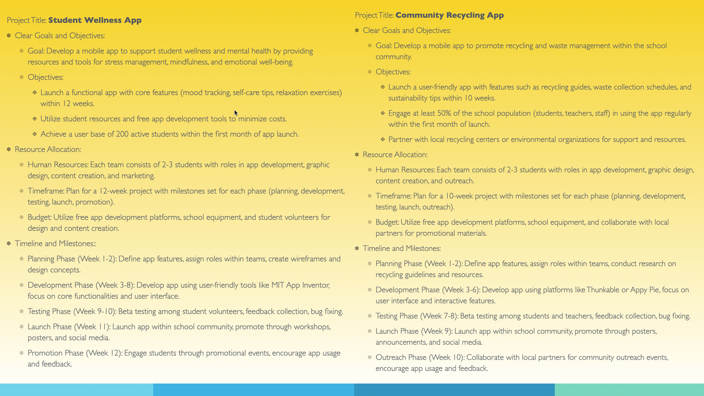

# System Development Lifecycle

### Learning Objectives

- Discuss the stages in system development life cycle
- Take a detailed look into the key points in each stage
- Explain the terms end-user and stakeholder
- Distinguish between the end-user and the stakeholder in a given scenario

## Stages (cycle)

1. [Planning](#planning)
2. [Analysis](#analysis)
3. Design
4. Development
5. Testing/Debugging
6. Implementation
7. Maintenance/Evaluation

- Development and implementation can be switched

## Planning

*Identify system goals.* Primary objectives and outcomes that the system should
achieve. What is the program trying to do?

*Define project scope.* Boundaries, deliverables, and constraints-- features,
functionalities, and target users.

*Set objectives.* SMART: Specific, measurable, achievable, relevant, time
bound. Aligns with system goals and project scope.

*Establish timeline.* How long will it take? Milestones, checkpoints, phases,
deadlines, and some leniency in timing. 

*Determine available resources.* Identify and allocate necessary resources.
Human resources, budget, technology, materials for project implementation.

*Importance.* Ensure alignment with organizational needs, sets clear direction.

## Analysis

*Understand system requirements.* Through interviews, process study, analyze
existing system processes.

*Identify stakeholders' needs,* preferences, and challenges. Ensure project
meets expectations. 

