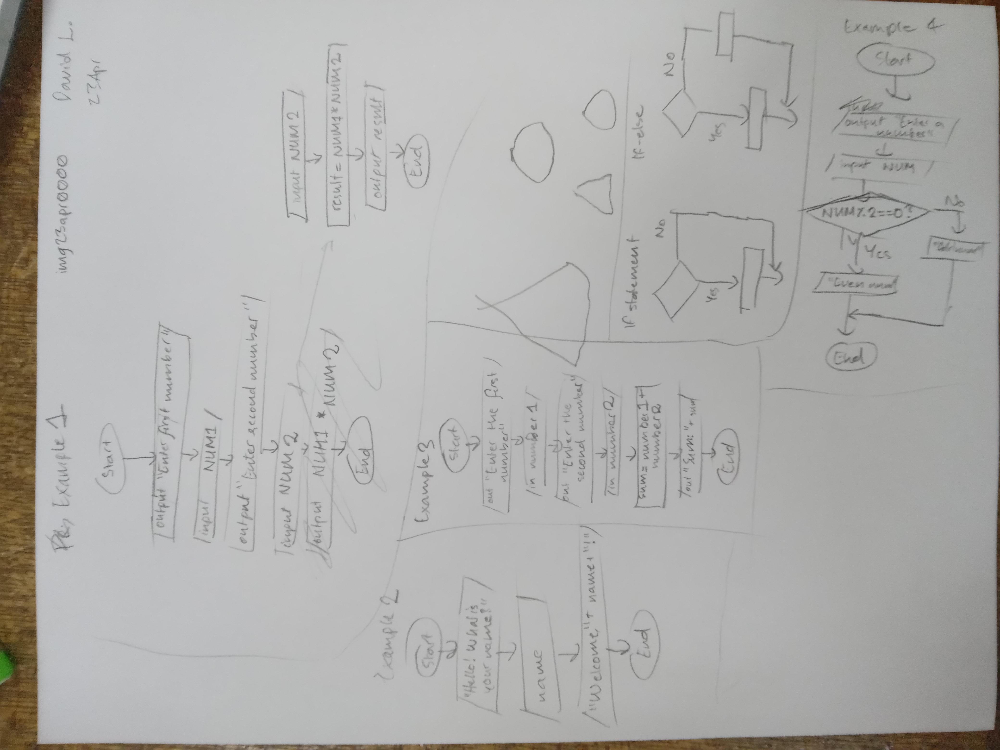
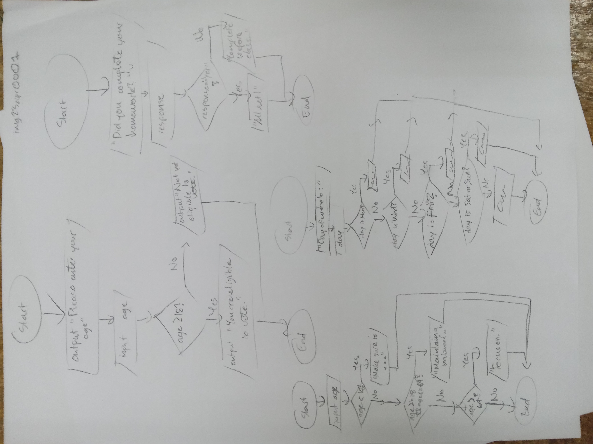

# Flowchart

Diagram that illustrates the *sequence of operations* to be performed to get to
the solution of a problem. *One input, one output.* 

Start with a *trigger event*. Direction is important- top to bottom, left to
right. The flowchart has a logical *start and finish*.

## Shapes

| Description			| Shape |
| --- | --- |
| *Start and end*		| rounded rectangle |
| *Process*				| rectangle |
| *Input and output*	| parallelogram |
| *Condition*			| diamond (also called *selection* or *decision*) |

All have only *one arrow out* except for the diamond, which has *two* and only
two outputs (yes or no).

Diamond statements always asked as a yes or no question.

[comment]: # (Add handwritten images later)

